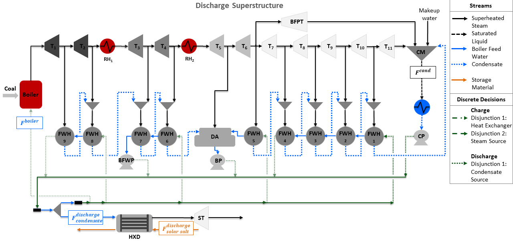

.. _Design of Integrated Ultra-Supercritical Power Plant:

Design of Integrated Ultra-Supercritical Power Plant
====================================================

The Design of Integrated Ultra-Supercritical Power Plant is comprised of two superstructure models to determine the optimal design of charge and discharge cycles of a thermal energy storage system (TES) integrated with a pulverized coal-fired ultra-supercritical power plant. The superstructure models are formulated using Generalized Disjunctive Programming (GDP) and include discrete and continuous design decisions. The discrete design decisions are included as disjunctions and identify the optimal integration points of TES with the power plant, while the continuous design decisions are the size and operating conditions of TES. A conceptual representation of each superstructure is shown in the flowsheets below, where the green dotted and dashed lines represent the discrete design decisions for each storage cycle integrated with the power plant.

.. image:: ../../images/charge_design_ultra_supercritical_powerplant.png
	   :align: center

Abbreviations
-------------

================================== ================================================================
Acronym                            Name
================================== ================================================================
:math:`RH`                         Reheater (:math:`RH_1` and :math:`RH_2`)
:math:`T`                          Turbine (:math:`T_1` to :math:`T_{11}`)
:math:`BFPT`                       Boiler Feed Water Pump Turbine
:math:`ST`                         Storage Turbine
:math:`FWH`                        Feed Water Heater (:math:`FWH_1` to :math:`FWH_9`)
:math:`CM`                         Condensate Mixer
:math:`CP`                         Condenser Pump
:math:`BP`                         Booster Pump
:math:`BFWP`                       Boiler Feed Water Pump
:math:`SP`                         Storage Pump
:math:`DA`                         Deaerator
:math:`CS`                         Charge Splitter
:math:`DS`                         Discharge Splitter
:math:`HXC`                        Charge Storage Heat Exchanger
:math:`HXD`                        Discharge Storage Heat Exchanger
:math:`VHP`                        Very High Pressure
:math:`HP`                         High Pressure
:math:`F^{boiler}`                 Boiler Flow Inlet (mol/s)
:math:`F^{cond}`                   Condenser Flow Outlet (mol/s)
:math:`F^{charge}_{steam}`         Steam Flow to Charge Storage System (mol/s)
:math:`F^{charge}_{solar salt}`    Solar Salt Flow to Charge Storage System (kg/s)
:math:`F^{charge}_{hitec salt}`    Hitec Salt Flow to Charge Storage System (kg/s)
:math:`F^{charge}_{oil}`           Thermal Oil Flow to Charge Storage System (kg/s)
:math:`F^{discharge}_{condensate}` Condensate Flow to Discharge Storage System (mol/s)
:math:`F^{discharge}_{solar salt}` Solar Salt Flow to Discharge Storage System (kg/s)
================================== ================================================================

Model Structure
---------------

For the construction of the charge and discharge GDP design models, the power plant model described in :ref:`Ultra-Supercritical Power Plant` is used as the base model to integrate the storage system. The charge cycle of TES uses a heat exchanger, a splitter, a cooler, and a pump, while the discharge cycle uses a heat exchanger, a splitter, and a turbine `ST`, where `ST` is used to produce additional power using the steam generated from the discharge heat exchanger.  Both, charge and discharge design models use unit models from the IDAES power generation unit model library, the IAPWS property package for steam and water, and the property packages for Solar Salt Property Package, Hitec Salt Property Package, and :ref:`Thermal Oil Property Package`. The unit models used in the design superstructures are shown in the table below:

================================= =====================================================================
Unit Model                        Units in Flowsheet
================================= =====================================================================
:math:`HelmTurbineStage`          Turbines (:math:`T_1` to :math:`T_{11}`) and :math:`BFPT`
:math:`HelmSplitter`              Turbine Splitters
:math:`Heater`                    Boiler Components (:math:`Boiler`, :math:`RH_1`, and :math:`RH_2`)
:math:`HelmMixer`                 Mixers (:math:`CM` and :math:`DA`)
:math:`HelmIsentropicCompresssor` Pumps (:math:`CP`, :math:`BP`, :math:`BFWP`, and :math:`SP`)
:math:`HeatExchanger`             Condenser, Feed Water Heaters (:math:`FWH_1` to :math:`FWH_9`),
                                  and Storage Systems (:math:`HXC` and :math:`HXD`)
================================= =====================================================================

Discrete Design Decisions
-------------------------
The charge superstructure includes two disjunctions for the optimal integration of the charge cycle. Disjunction 1 selects either Solar salt, Hitec salt, or Thermal oil as the heat transfer fluid for the charge heat exchanger. Disjunction 2 selects between a very high-pressure or high-pressure steam as the heat source for the charge heat exchanger. Given the two disjunctions, the charge superstructure considers 6 alternative flowsheet configurations. The different design alternatives are given in the following table:

============================== ============ ========================================================
Charge Design Decisions         Disjunction Description
============================== ============ ========================================================
:math:`solar_-salt_-disjunct`  1            Disjunct 1 to select solar salt as the storage material in charge heat exchanger
:math:`hitec_-salt_-disjunct`  1            Disjunct 2 to select hitec salt as the storage material in charge heat exchanger
:math:`thermal_-oil_-disjunct` 1            Disjunct 3 to select solar salt as the storage material in charge heat exchanger
:math:`VHP_-source_-disjunct`  2            Disjunct 1 to select a very high-pressure steam from the power plant to charge the storage system
:math:`HP_-source_-disjunct`   2            Disjunct 2 to select a high-pressure steam from the power plant to charge the storage system
============================== ============ ========================================================

The discharge superstructure includes one disjunction to select the condensate source to generate steam in the discharge heat exchanger. Given the condensate disjunction, the discharge superstructure considers 5 alternative flowsheet configurations. The alternative design decisions are given in the following table:

============================== =========== ==========================================================
Discharge Design Decision      Disjunction Description
============================== =========== ==========================================================
:math:`CP_-source_-disjunct`    1           Disjunct 1 to select condenser pump as the condensate source for discharge system
:math:`FWH4_-source_-disjunct`  1           Disjunct 2 to select feed water heater 4 as the condensate source for discharge system
:math:`BP_-source_-disjunct`    1           Disjunct 3 to select the booster pump as the condensate source for discharge system
:math:`BFWP_-source_-disjunct`  1           Disjunct 4 to select the boiler feed water pump as the condensate source for discharge system
:math:`FWH9_-source_-disjunct`  1           Disjunct 5 to select the feed water heater 9 as the condensate source for the discharge system
============================== =========== ==========================================================

Degrees of Freedom
------------------

The charge integrated ultra-supercritical power plant model has a total of 9 degrees of freedom, of which 5 are binary decisions, as shown in the list below:

1) Selection of solar salt heat exchanger (:math:`solar_-salt_-disjunct` is :math:`True` or :math:`False`)

2) Selection of hitec salt heat exchanger (:math:`hitec_-salt_-disjunct` is :math:`True` or :math:`False`)

3) Selection of thermal oil heat exchanger (:math:`thermal_-oil_-disjunct` is :math:`True` or :math:`False`)

4) Selection of very high-pressure steam to charge heat exchanger (:math:`VHP_-source_-disjunct` is :math:`True` or :math:`False`)

5) Selection of high-pressure steam to charge heat exchanger (:math:`HP_-source_-disjunct` is :math:`True` or :math:`False`)

6) Steam flow to charge heat exchanger (:math:`HXC.inlet_-1.flow_-mol`)
   
7) Cooler enthalpy at outlet (:math:`cooler.outlet.enth_-mol`)
    
8) Heat transfer fluid mass flow rate at inlet 2 of charge heat exchanger (:math:`HXC.inlet_-2.flow_-mass`)

9) Charge heat exchanger area (:math:`HXC.area`)

The discharge integrated ultra-supercritical power plant model has a total of 7 degrees of freedom, of which 5 are binary decisions, as shown below:

1) Selection of condenser pump as condensate source to discharge heat exchanger (:math:`CP_-source_-disjunct` is :math:`True` or :math:`False`)

2) Selection of feed water heater 4 as condensate source to discharge heat exchanger (:math:`FWH4_-source_-disjunct` is :math:`True` or :math:`False`)

3) Selection of booster pump as condensate source to discharge heat exchanger (:math:`BP_-source_-disjunct` is :math:`True` or :math:`False`)
 
4) Selection of boiler feed water pump as condensate source to discharge heat exchanger (:math:`BFWP_-source_-disjunct` is :math:`True` or :math:`False`)

5) Selection of feed water heater 9 as condensate source to discharge heat exchanger (:math:`FWH9_-source_-disjunct` is :math:`True` or :math:`False`)

6) Condensate flow to discharge heat exchanger (:math:`HXD.inlet_-2.flow_-mol`),

7) Solar salt mass flow rate at inlet 2 of discharge heat exchanger (:math:`HXD.inlet_-1.flow_-mass`)

Notable Variables
-----------------

======================= ========================================================
Variable Name           Description
======================= ========================================================
:math:`PlantPowerOut`   Power out from the power plant in MW
:math:`CapitalCost`     Capital cost of storage system in $ per year
:math:`HXCArea`         Area of charge heat exchanger in :math:`m^2`
:math:`HXDArea`         Area of discharge heat exchanger in :math:`m^2`
======================= ========================================================

Notable Constraints
-------------------

**Charge**

1) The power production for the charge ultra-supercritical model includes the storage pump power, as shown in the equation below: 

.. math:: PlantPowerOut  = \sum^{11}_{i=1} T_i.mechanical_-work - SP.work

**Discharge**

1) The net power is given by the sum of the power produced by the storage system and the plant as shown in the following equation:

.. math:: NetPower = PlantPowerOut + ST.mechanical_-work

