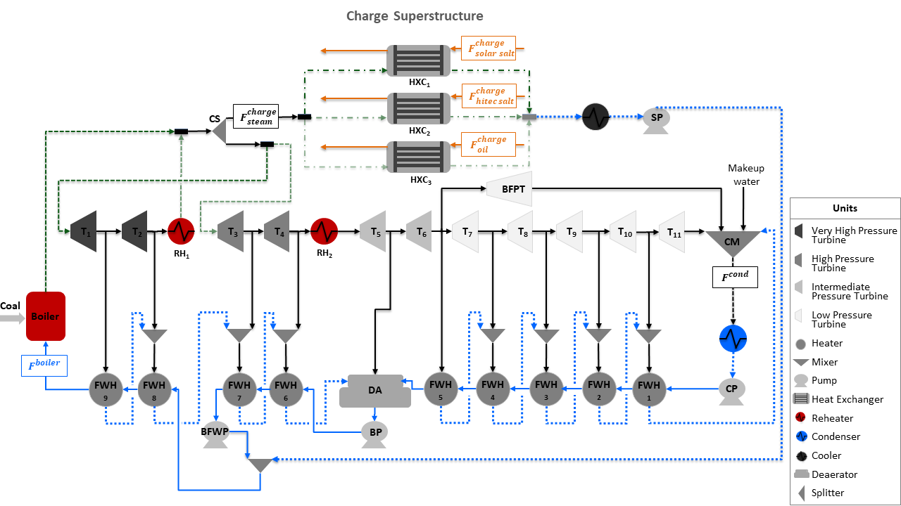

Design of Integrated Ultra-Supercritical Power Plant
=================================================

The Design of Integrated Ultra-Supercritical Power Plant are two example models to determine the optimal location and design of a charge and discharge thermal energy storage system integrated with a pulverized coal-fired ultra-supercritical power plant using a Generalized Disjunctive Programming formulation. To identify the optimal location and design of the storage systems in the power plant, two superstructures are built, one for charging the system and the second one for discharging the storage system. The discrete design decisions are included to the model as logical constraints using disjunctions. A conceptual representation of the charge and discharge superstructures is shown in the flowsheets below:

.. image:: ../../images/discharge_design_ultra_supercritical_powerplant.png
	   :align: center

Abbreviations
-------------

================================== ================================================================
Acronym                            Name
================================== ================================================================
:math:`RH`                         Reheater (:math:`RH_1` and :math:`RH_2`)
:math:`T`                          Turbine (:math:`T_1` to :math:`T_{11}`)
:math:`BFPT`                       Boiler Feed Water Pump Turbine
:math:`ST`                         Storage Turbine
:math:`FWH`                        Feed Water Heater (:math:`FWH_1` to :math:`FWH_9`)
:math:`CM`                         Condensate Mixer
:math:`CP`                         Condenser Pump
:math:`BP`                         Booster Pump
:math:`BFWP`                       Boiler Feed Water Pump
:math:`SP`                         Storage Pump
:math:`DA`                         Deaerator
:math:`CS`                         Charge Splitter
:math:`DS`                         Discharge Splitter
:math:`HXC`                        Charge Storage Heat Exchanger
:math:`HXD`                        Discharge Storage Heat Exchanger
:math:`F^{boiler}`                 Boiler Flow Inlet (mol/s)
:math:`F^{cond}`                   Condenser Flow Outlet (mol/s)
:math:`F^{charge}_{steam}`         Steam Flow to Charge Storage System (mol/s)
:math:`F^{charge}_{solar salt}`    Solar Salt Flow to Charge Storage System (kg/s)
:math:`F^{charge}_{hitec salt}`    Hitec Salt Flow to Charge Storage System (kg/s)
:math:`F^{charge}_{oil}`           Thermal Oil Flow to Charge Storage System (kg/s)
:math:`F^{discharge}_{condensate}` Condensate Flow to Discharge Storage System (mol/s)
:math:`F^{discharge}_{solar salt}` Solar Salt Flow to Discharge Storage System (kg/s)
================================== ================================================================

Model Structure
---------------

The charge and discharge ultra-supercritical models use unit models from the power generation unit model library, as shown in the table below.  The charge system comprises a storage heat exchanger, a splitter, a cooler, and a pump, while the discharge storage system includes a storage heat exchanger, a splitter, and a turbine. Some of the parameters in the model such as feed water heater areas, overall heat transfer coefficient, turbine efficiencies at multiple stages have all been estimated for a total power out of 437 MW.

================================= =====================================================================
Unit Model                        Units in Flowsheet
================================= =====================================================================
:math:`HelmTurbineStage`          Turbines (:math:`T_1` to :math:`T_{11}`) and :math:`BFPT`
:math:`HelmSplitter`              Turbine Splitters
:math:`Heater`                    Boiler Components (:math:`Boiler`, :math:`RH_1`, and :math:`RH_2`)
:math:`HelmMixer`                 Mixers (:math:`CM` and :math:`DA`)
:math:`HelmIsentropicCompresssor` Pumps (:math:`CP`, :math:`BP`, :math:`BFWP`, and :math:`SP`)
:math:`HeatExchanger`             Condenser, Feed Water Heaters (:math:`FWH_1` to :math:`FWH_9`),
                                  and Storage Systems (:math:`HXC` and :math:`HXD`)
================================= =====================================================================

Discrete Design Decisions
-------------------------
The charge superstructure power plant model includes two disjunctions for the optimal location of the storage system. The first disjunction selects between a very high-pressure or high-pressure steam as the heat source for the charge heat exchanger. Disjunction 2 selects between Solar salt, Hitec salt, and Thermal oil as the storage material for the storage heat exchanger. Given the two disjunctions, this charge superstructure considers 6 alternative configurations for charging the integrated storage system. The charge design decisions are given in the following table:

============================== ========================================================
Charge Design Decisions         Description
============================== ========================================================
:math:`solar_-salt_-disjunct`  Disjunct 1 in disjunction 1 to select solar salt as the storage material in charge heat exchanger
:math:`hitec_-salt_-disjunct`  Disjunct 2 in disjunction 1 to select hitec salt as the storage material in charge heat exchanger
:math:`thermal_-oil_-disjunct` Disjunct 3 in disjunction 1 to select solar salt as the storage material in charge heat exchanger
:math:`vhp_-source_-disjunct`  Disjunct 1 in disjunction 2 to select a very high pressure steam from the power plant to charge the storage system
:math:`hp_-source_-disjunct`   Disjunct 2 in disjunction 2 to select a high pressure steam from the power plant to charge the storage system
============================== ========================================================

The discharge superstructure power plant model includes one disjunction to select the condensate source to generate steam in the discharge heat exchanger. This generated steam is further used to produce power using a storage turbine that is connected to the discharge heat exchanger. Given the condensate disjunction, the discharge superstructure considers 5 alternative configurations for discharging the storage system. The discharge design decisions are given in the following table:

=============================== ========================================================
Discharge Design Decision       Description
=============================== ========================================================
:math:`CP_-source_-disjunct`    Disjunct 1 in disjunction 1 to select condenser pump as the condensate source for discharge system
:math:`FWH4_-source_-disjunct`  Disjunct 2 in disjunction 1 to select feed water heater 4 as the condensate source for discharge system
:math:`BP_-source_-disjunct`    Disjunct 3 in disjunction 1 to select the booster pump as the condensate source for discharge system
:math:`BFWP_-source_-disjunct`  Disjunct 1 in disjunction 1 to select the boiler feed water pump as the condensate source for discharge system
:math:`FWH9_-source_-disjunct`  Disjunct 2 in disjunction 1 to select the feed water heater 9 as the condensate source for the discharge system
=============================== ========================================================

Degrees of Freedom
------------------

The charge integrated ultra-supercritical power plant model has a total of 14 degrees of freedom, while the discharge integrated ultra-supercritical power plant model has a total of 20 degrees of freedom. These are listed below:

**Charge**

1) Boiler feed water molar flow (:math:`boiler.inlet.flow_-mol`),

2) Turbine 1 molar flow (:math:`T_1.inlet.flow_-mol`),

3) Turbine 1 pressure (:math:`T_1.inlet.pressure`),

4) Turbine 1 molar enthalpy (:math:`T_1.inlet.enth_-mol`),

5) Turbine 3 molar flow (:math:`T_3.inlet.flow_-mol`),

6) Turbine 3 pressure (:math:`T_3.inlet.pressure`),

7) Turbine 3 molar enthalpy (:math:`T_3.inlet.enth_-mol`),

8) Charge splitter molar flow outlet to storage (:math:`charge.splitter.outlet_-2.flow_-mol`)

9) Charge storage pump pressure at outlet (:math:`charge.storage_-pump.outlet.pressure`)

10) Cooler molar flow at inlet (:math:`charge.cooler.inlet.flow_-mol`)

11) Cooler pressure at inlet (:math:`charge.cooler.inlet.pressure`)

12) Cooler enthalpy in charge system (:math:`cooler.outlet.enth_-mol`)
    
13) Storage material massic flow at inlet 2 of storage heat exchanger (:math:`charge.hxc.inlet_-2.flow_-mass`)

14) Charge heat exchanger area (:math:`charge.hxc.area`)

**Discharge**

1) Boiler feed water molar flow at inlet (:math:`boiler.inlet.flow_-mol`),
 
2) Boiler pressure at inlet (:math:`FWH1.inlet.pressure`),

3) Boiler molar enthalpy at inlet (:math:`FWH1.inlet.enth_-mol`),

4) Feed water heater 1 molar flow at inlet (:math:`FWH1.inlet.flow_-mol`),

5) Feed water heater 1 pressure at inlet (:math:`FWH1.inlet.pressure`),

6) Feed water heater 1 molar enthalpy at inlet (:math:`FWH1.inlet.enth_-mol`),

7) Feed water heater 5 molar flow at inlet (:math:`FWH5.inlet.flow_-mol`),

8) Feed water heater 5 pressure at inlet (:math:`FWH5.inlet.pressure`),

9) Feed water heater 5 molar enthalpy at inlet (:math:`FWH_-5.inlet.enth_-mol`),

10) Feed water heater 6 molar flow at inlet (:math:`FWH6.inlet.flow_-mol`),

11) Feed water heater 6 pressure at inlet (:math:`FWH6.inlet.pressure`),

12) Feed water heater 8 molar enthalpy at inlet (:math:`FWH8.inlet.enth_-mol`),

13) Feed water heater 8 molar flow at inlet (:math:`FWH8.inlet.flow_-mol`),

14) Feed water heater 8 pressure at inlet (:math:`FWH8.inlet.pressure`),

15) Feed water heater 8 molar enthalpy at inlet (:math:`FWH8.inlet.enth_-mol`),

16) Discharge splitter molar flow outlet to storage (:math:`discharge.splitter.outlet_-2.flow_-mol`)
   
17) Solar salt massic flow at inlet 2 of discharge solar salt heat exchanger (:math:`discharge.hxd.inlet_-2.flow_-mass`)

18) Discharge solar salt heat exchanger area (:math:`discharge.hxd.area`)

Notable Variables
-----------------

======================= ========================================================
Variable Name           Description
======================= ========================================================
:math:`PlantPowerOut`   Power out from the power plant in MW
:math:`OperatingCost`   Operating cost of power plant in $ per hour
:math:`CapitalCost`     Capital cost of storage system in $ per year
:math:`StorageArea`     Area of storage heat exchanger in :math:`m^2`
:math:`StorageHeatDuty` Heat duty of storage heat exchanger in MW
======================= ========================================================

Notable Constraints
-------------------

**Charge**

1) The power production for the charge ultra-supercritical model includes the storage pump power, as shown in the equation below: 

.. math:: PlantPowerOut  = \sum^{11}_{i=1} T_i.mechanical_work - SP.work

.. automodule:: dispatches.models.fossil_case.ultra_supercritical_plant.storage.usc_storage_nlp_mp

