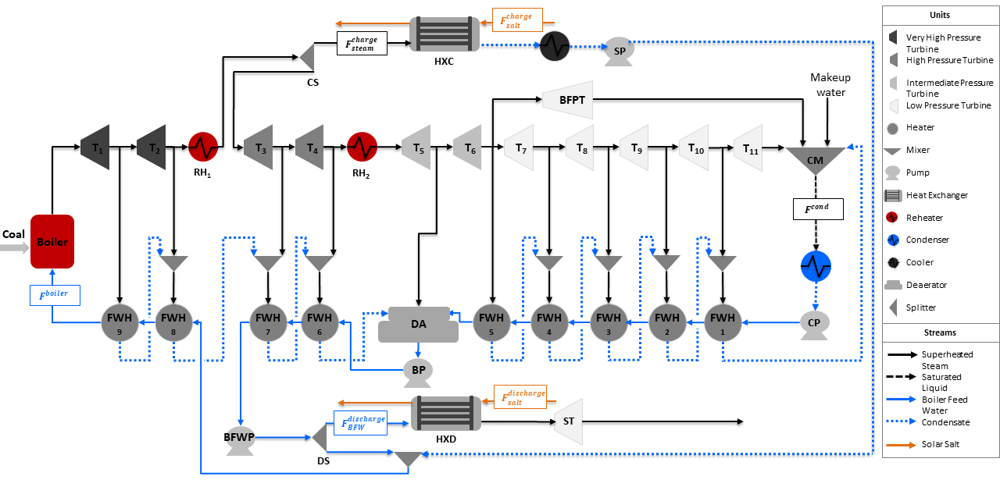

.. _Integrated Ultra-Supercritical Power Plant:

Integrated Ultra-Supercritical Power Plant
==========================================

The Integrated Ultra-Supercritical Power Plant is an example model to determine the optimal operation of a pulverized coal-fired ultra-supercritical power plant integrated with a thermal energy storage system (TES) for a given electricity price. This model integrates a Solar salt charge and discharge heat exchanger in the :ref:`Ultra-Supercritical Power Plant` model. A flowsheet of the integrated power plant is shown in the figure below:

Abbreviations
-------------

============================ ================================================================
Acronym                      Name
============================ ================================================================
:math:`RH`                   Reheater (:math:`RH_1` and :math:`RH_2`)
:math:`T`                    Turbine (:math:`T_1` to :math:`T_{11}`)
:math:`BFPT`                 Boiler Feed Water Pump Turbine
:math:`ST`                   Storage Turbine
:math:`FWH`                  Feed Water Heater (:math:`FWH_1` to :math:`FWH_9`)
:math:`CM`                   Condensate Mixer
:math:`CP`                   Condenser Pump
:math:`BP`                   Booster Pump
:math:`BFWP`                 Boiler Feed Water Pump
:math:`SP`                   Storage Pump
:math:`DA`                   Deaerator
:math:`CS`                   Charge Splitter
:math:`DS`                   Discharge Splitter
:math:`HXC`                  Charge Storage Heat Exchanger
:math:`HXD`                  Discharge Storage Heat Exchanger
:math:`BFW`                  Boiler Feed Water
:math:`F^{boiler}`           Boiler Flow Inlet (mol/s)
:math:`F^{cond}`             Condenser Flow Outlet (mol/s)
:math:`F^{charge}_{steam}`   Steam Flow to Charge Storage System (mol/s)
:math:`F^{charge}_{salt}`    Salt Flow to Charge Storage System (kg/s)
:math:`F^{discharge}_{BFW}`  Boiler Feed Water Flow to Discharge Storage System (mol/s)
:math:`F^{discharge}_{salt}` Salt Flow to Discharge Storage System (kg/s)
============================ ================================================================

Model Structure
---------------

For the construction of the integrated power plant model, the :ref:`Ultra-Supercritical Power Plant` model is used as the base model to integrate the charge and discharge heat exchangers. The optimal integration point and design of both storage heat excahngers are obtained using the :ref:`Design of Integrated Ultra-Supercritical Power Plant` model. The integrated model is also constructed using the unit models from the power generation unit model library in addition to the IAPWS property package for steam and water, and the Solar salt property package in the storage heat exchangers. The unit models used are shown in the table below: 

================================= =====================================================================
Unit Model                        Units in Flowsheet
================================= =====================================================================
:math:`HelmTurbineStage`          Turbines (:math:`T_1` to :math:`T_{11}`) and :math:`BFPT`
:math:`HelmSplitter`              Turbine Splitters
:math:`Heater`                    Boiler Components (:math:`Boiler`, :math:`RH_1`, and :math:`RH_2`)
:math:`HelmMixer`                 Mixers (:math:`CM` and :math:`DA`)
:math:`HelmIsentropicCompresssor` Pumps (:math:`CP`, :math:`BP`, :math:`BFWP`, and :math:`SP`)
:math:`HeatExchanger`             Condenser, Feed Water Heaters (:math:`FWH_1` to :math:`FWH_9`),
                                  and Storage Systems (:math:`HXC` and :math:`HXD`)
================================= =====================================================================

Degrees of Freedom
------------------

The integrated ultra-supercritical power plant model has a total of 4 degrees of freedom, listed below:

1) Boiler feed water flow (:math:`boiler.inlet.flow_-mol`),

2) Steam flow to charge heat exchanger (:math:`HXC.inlet_-1.flow_-mol`)

3) Condensate flow to discharge heat exchanger (:math:`HXD.inlet_-2.flow_-mol`),

4) Cooler enthalpy at outlet (:math:`cooler.outlet.enth_-mol`)

Notable Variables
-----------------

========================= ========================================================
Variable Name             Description
========================= ========================================================
:math:`PlantPowerOut`     Power out from the power plant in MW
:math:`Revenue`           Revenue in $ per hour
:math:`SaltInventory`     Total solar salt inventory in kg
:math:`HotSaltInventory`  Hot solar salt inventory in kg
========================= ========================================================

Notable Constraints
-------------------

1) The net power is given by the sum of the power produced by the storage system and the plant as shown in the following equation:

.. math:: NetPower = PlantPowerOut + ST.mechanical_-work

2) The revenue is calculated by considering the given electricity price :math:`lmp_-signal` and the amount of net power :math:`NetPower` produced by the plant and the storage system. This is shown in the equation below:

.. math:: Revenue = lmp_-signal * NetPower

3) The salt inventory :math:`SaltInventory` is given by the hot salt and total salt material balances, the latter involving a fixed amount of salt :math:`total_-salt`. The material balances are shown in the following equations:

.. math:: HotSaltInventory = HotSaltInventory + F^{charge}_{salt, outlet} - F^{discharge}_{salt, inlet}

.. math:: total_-salt = HotSaltInventory + ColdSaltInventory
