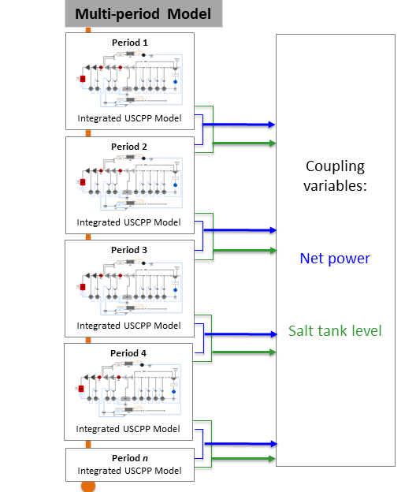

.. _Multiperiod Integrated Ultra-Supercritical Power Plant:

Multiperiod Integrated Ultra-Supercritical Power Plant
======================================================

The Multiperiod Integrated Ultra-Supercritical Power Plant is an example model to determine the optimal schedule and operation of a pulverized coal-fired ultra-supercritical power plant integrated with thermal energy storage system (TES) for given electricity prices over a time horizon. The multiperiod model uses the :ref:`Integrated Ultra-supercritical Power Plant` model for each period in the horizon. A more detailed description of the model is given in the sections below.

Model Structure
---------------

The multiperiod power plant model is developed by creating multiple instances of :ref:`Integrated Ultra-Supercritical Power Plant` model, where every instance is indexed by a time period, along with two coupling variables to link each time period. These coupling variables are: the optimal power produced by the power plant and the amount of storage material available at the end of each time period. A scheme showing how the multiperiod model is constructed is shown in the figure below:

Degrees of Freedom
------------------

The multiperiod model has a total of 4 :math:`n` degrees of freedom, where :math:`n` represents the number of time periods. The degrees of freedom for each time period are listed below:

1) Boiler feed water flow (:math:`boiler.inlet.flow_-mol`),
 
2) Steam flow to charge heat exchanger (:math:`HXC.inlet_-1.flow_-mol`)
   
3) Condensate flow to discharge heat exchanger (:math:`HXD.inlet_-2.flow_-mol`),

4) Cooler enthalpy at outlet (:math:`cooler.outlet.enth_-mol`)

Notable Variables
-----------------

========================= ========================================================
Variable Name             Description
========================= ========================================================
:math:`NetPower_t`        Net power out from the power plant at each time period  in MW
:math:`SaltInventory_t`   Solar salt inventory at each time period in kg
========================= ========================================================

Notable Constraints
-------------------

1) Power plant ramping is limited by including the following equations for a given :math:`ramp_-rate`:

.. math:: NetPower_{t-1}  - ramp_-rate \leq NetPower_t
.. math:: NetPower_{t-1}  + ramp_-rate \geq NetPower_t

2) The salt inventory :math:`SaltInventory` is given by the hot salt and total salt material balances, the latter involving a fixed amount of salt :math:`total_-salt`. The material balances are shown in the following equations:

.. math:: HotSaltInventory_t = HotSaltInventory_{t-1} + F^{charge}_{salt, outlet} - F^{discharge}_{salt, inlet}
.. math:: total_-salt = HotSaltInventory_t + ColdSaltInventory_t

Note that the notable constraints and variables in the multiperiod model also consider the notable variables and constraints given in :ref:`Integrated Ultra-Supercritical Power Plant`.
