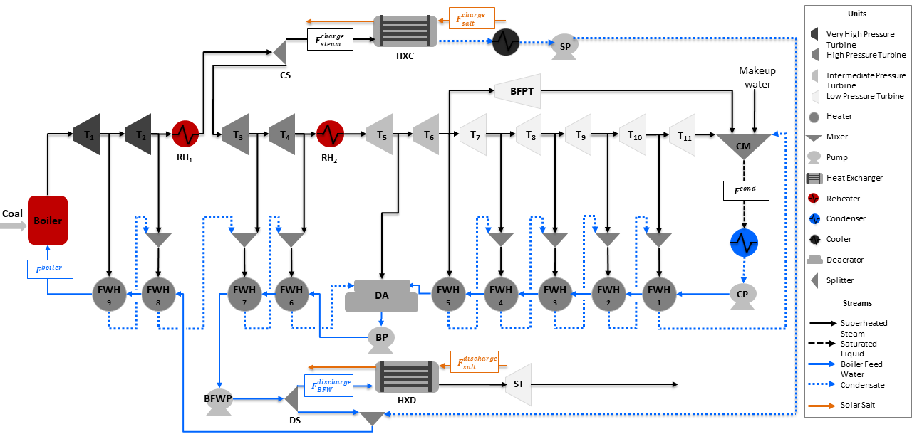

Multiperiod Integrated Ultra-Supercritical Power Plant
======================================================

The Multiperiod Integrated Ultra-Supercritical Power Plant is an example model to determine the optimal schedule and operation of a pulverized coal-fired ultra-supercritical power plant integrated with thermal energy storage system over a time horizon for given electricity prices. This model comprises a charge and discharge storage heat exchangers integrated with the power plant. The process flowsheet of the integrated power plant is shown in the figure below.

Abbreviations
-------------
	    
============================ ================================================================
Acronym                      Name
============================ ================================================================
:math:`RH`                   Reheater (:math:`RH_1` and :math:`RH_2`)
:math:`T`                    Turbine (:math:`T_1` to :math:`T_{11}`)
:math:`BFPT`                 Boiler Feed Water Pump Turbine
:math:`ST`                   Storage Turbine
:math:`FWH`                  Feed Water Heater (:math:`FWH_1` to :math:`FWH_9`)
:math:`CM`                   Condensate Mixer
:math:`CP`                   Condenser Pump
:math:`BP`                   Booster Pump
:math:`BFWP`                 Boiler Feed Water Pump
:math:`SP`                   Storage Pump
:math:`DA`                   Deaerator
:math:`CS`                   Charge Splitter
:math:`DS`                   Discharge Splitter
:math:`HXC`                  Charge Storage Heat Exchanger
:math:`HXD`                  Discharge Storage Heat Exchanger
:math:`BFW`                  Boiler Feed Water
:math:`F_{boiler}`           Boiler Flow Inlet (mol/s)
:math:`F_{cond}`             Condenser Flow Outlet (mol/s)
:math:`F^{charge}_{steam}`   Steam Flow to Charge Storage System (mol/s)
:math:`F^{charge}_{salt}`    Salt Flow to Charge Storage System (kg/s)
:math:`F^{discharge}_{BFW}`  Boiler Feed Water Flow to Discharge Storage System (mol/s)
:math:`F^{discharge}_{salt}` Salt Flow to Discharge Storage System (kg/s)
============================ ================================================================

Model Structure
---------------

The multiperiod power plant model is developed by creating multiple instances of a steady-state nonlinear power plant model, with every instance indexed for a time period, along with two coupling variables to link each time step, which are the optimal power produced by the power plant and the amount of storage material available at the end of each time period. The power plant model is constructed using the unit models from the idaes/power_generation unit model library shown in the table below, in addition to the IAPWS property package for steam and water.

================================= =====================================================================
Unit Model                        Units in Flowsheet
================================= =====================================================================
:math:`HelmTurbineStage`          Turbines (:math:`T_1` to :math:`T_{11}`) and :math:`BFPT`
:math:`HelmSplitter`              Turbine Splitters
:math:`Heater`                    Boiler Components (:math:`Boiler`, :math:`RH_1`, and :math:`RH_2`)
:math:`HelmMixer`                 Mixers (:math:`CM` and :math:`DA`)
:math:`HelmIsentropicCompresssor` Pumps (:math:`CP`, :math:`BP`, :math:`BFWP`, and :math:`SP`)
:math:`HeatExchanger`             Condenser, Feed Water Heaters (:math:`FWH_1` to :math:`FWH_9`),
                                  and Storage Systems (:math:`HXC` and :math:`HXD`)
================================= =====================================================================

Degrees of Freedom
------------------

The multiperiod integrated ultra-supercritical power plant model has a total of 4 :math:`n` degrees of freedom, where :math:`n` represents the number of time periods. The degrees of freedom for each time period are listed below:

1) Boiler feed water flow (:math:`boiler.inlet.flow_-mol`),
 
2) Charge splitter flow to storage (:math:`charge_-splitter.outlet_-2.flow_-mol`)
   
3) Discharge splitter flow to storage (:math:`discharge_-splitter.outlet_-2.flow_-mol`),

4) Cooler enthalpy in charge system (:math:`cooler.outlet.enth_-mol`)

Notable Variables
-----------------

========================= ========================================================
Variable Name             Description
========================= ========================================================
:math:`NetPower`          Net power out from the power plant in MW
:math:`PlantHeatDuty`     Total boiler heat duty (i.e., :math:`Boiler`, :math:`RH_1`, and :math:`RH_2`) in MWth
:math:`HotSaltInventory`  Hot storage material flow (i.e., :math:`F^{charge}_{salt, outlet}` and :math:`F^{discharge}_{salt, inlet}`) in kg/s
========================= ========================================================

Notable Constraints
-------------------

1) Ramping in the power plant is limited to a given ramping value :math:`ramp_-rate` by including the following equations:

.. math:: NetPower_{t-1}  - ramp_-rate \leq NetPower_t
.. math:: NetPower_{t-1}  + ramp_-rate \geq NetPower_t

2) The salt inventory :math:`SaltInventory` is given by the hot salt and total salt material balances, the latter involving a fixed amount of salt :math:`total_-salt`. The material balances are shown in the following equations:

.. math:: HotSaltInventory_t = HotSaltInventory_{t-1} + F^{charge}_{salt, outlet} - F^{discharge}_{salt, inlet}
.. math:: total_-salt = HotSaltInventory_t + ColdSaltInventory_t

.. automodule:: dispatches.models.fossil_case.ultra_supercritical_plant.storage.usc_storage_nlp_mp

