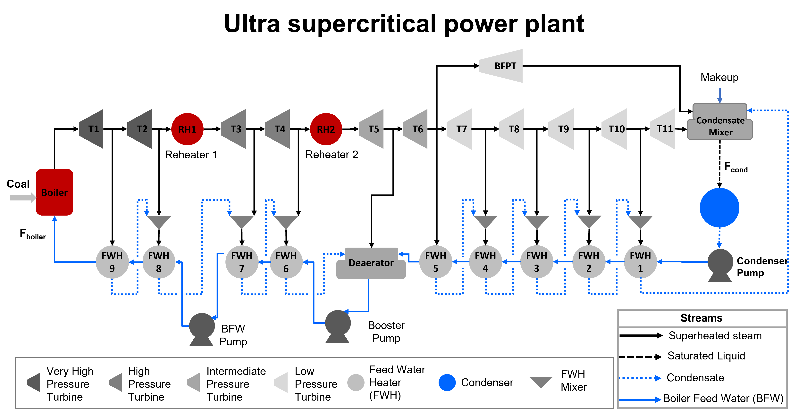

.. _Ultra-Supercritical Power Plant:

Ultra-Supercritical Power Plant
===============================

The DISPATCHES Ultra-Supercritical Power Plant model is an example flowsheet for a pulverized coal-fired ultra-supercritical power plant. This model simulates a plant producing 436 MW of gross power and it is based on the flowsheet presented in 1999 USDOE Report #DOE/FE-0400. A flowsheet of the power plant is shown in the figure below: 

	   
Abbreviations
-------------

================== ================================
Acronym            Name
================== ================================
:math:`RH`         Reheater (:math:`RH_1` and :math:`RH_2`)
:math:`T`          Turbine (:math:`T_1` to :math:`T_{11}`)
:math:`BFPT`       Boiler Feed Water Pump Turbine
:math:`FWH`        Feed Water Heaters (:math:`FWH_1` to :math:`FWH_9`)
:math:`CM`         Condensate Mixer
:math:`CP`         Condenser Pump
:math:`BP`         Booster Pump
:math:`BFWP`       Boiler Feed Water Pump
:math:`DA`         Deaerator
:math:`BFW`        Boiler Feed Water
:math:`F^{cond}`   Condenser Flow Outlet (mol/s)
:math:`F^{boiler}` Boiler Flow Inlet (mol/s)
================== ================================

Model Structure
---------------

The ultra-supercritical power plant model considers the following assumptions: (i) the heater unit models are used to model main steam boiler, reheater 1 and 2, and condenser, and (ii) the multi-stage turbines are modeled as multiple lumped single stage turbines. Some of the parameters in the model, such as the area of feed water heaters, the overall heat transfer coefficient of heat exchangers, and the efficiency of the turbines at multiple stages have been estimated for a total power out of 436 MW, while the main steam conditions, i. e. pressure and temperature, are adopted from the aforementioned DOE report. The ultra-supercritical power plant model is constructed using some units from the IDAES power generation unit model library and the IAPWS property package for steam and water. The unit models used in this model are shown in the table below:

================================= ============================================================
Unit Model                        Units in the flowsheet
================================= ============================================================
:math:`HelmTurbineStage`          Turbines (:math:`T_1` to :math:`T_{11}`) and :math:`BFPT`
:math:`HelmSplitter`              Turbine Splitters
:math:`Heater`                    Boiler components, i.e., :math:`Boiler`, :math:`RH_1`, and :math:`RH_2`
:math:`HelmMixer`                 Mixers (including :math:`CM` and :math:`DA`)
:math:`HelmIsentropicCompresssor` Pumps (including :math:`CP`, :math:`BP`, and :math:`BFWP`)
:math:`HeatExchanger`             Condenser and Feed Water Heaters (:math:`FWH_1` to :math:`FWH_9`)
================================= ============================================================

Degrees of Freedom
------------------

The ultra-supercritical Power Plant model has 2 degrees of freedom:

1) Boiler feed water flow (:math:`boiler.inlet.flow_-mol`)

2) Boiler feed water pressure (:math:`boiler.outlet.pressure`)

Notable Variables
-----------------

===================== ========================================================
Variable Name         Description
===================== ========================================================
:math:`PlantPowerOut` Net power out from the plant in MW
:math:`PlantHeatDuty` Total boiler heat duty (i.e., :math:`Boiler`, :math:`RH_1`, and :math:`RH_2`) in MWth
===================== ========================================================

Notable Constraints
-------------------

1) The outlet temperature of the boiler components is set to be 866 K, as shown in the following equation, where :math:`Unit` represents :math:`Boiler, RH_1`, and :math:`RH_2`:

.. math:: Unit.outlet.temperature = 866

2) :math:`PlantPowerOut` is given by the total turbine mechanical work, as shown in the following equation:

.. math:: PlantPowerOut = \sum^{11}_{i=1}{T_i.mechanical_-work}

3) :math:`PlantHeatDuty` is given as the summation of the heat duties of boiler components as shown in the following equation, where :math:`Unit` is in :math:`[Boiler, RH_1, RH_2]`:

.. math:: PlantHeatDuty = \sum_{Unit}{Unit.heat_-duty}
