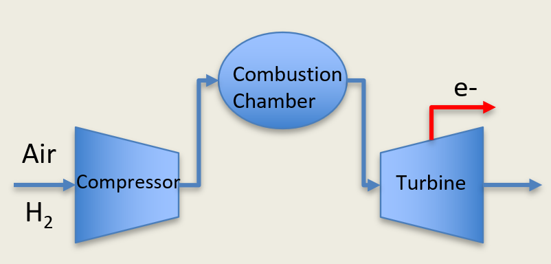

.. _hydrogenturbine:

Hydrogen Turbine
================

The DISPATCHES Hydrogen Turbine Model

Degrees of Freedom
------------------

The Hydrogen Turbine Model has 13 degrees of freedom.

Model Structure
---------------

The Hydrogen Turbine Model consists of a Compressor --> Stoichiometric Reactor --> Turbine. 
The Hydrogen is assumed to be compressed alongside the air that is flowing into the compressor 
rather than having a separate fuel injection system. 

Variables Used
--------------

The Hydrogen Turbine Model uses the follow variables:

===================== ============================================== ============================================================================
Variable              Name                                           Notes
===================== ============================================== ============================================================================
:math:`m_{flow}`      compressor.inlet.flow_mol[0]                   Total Molar flow rate into the inlet of the Compressor
:math:`T_{inlet}`     compressor.inlet.temperature[0]                Inlet Temperature of stream into the Compressor of the hydrogen turbine
:math:`P_{inlet}`     compressor.inlet.pressure[0]                   Inlet Pressure into the Compressor
:math:`w_{Oxygen}`    compressor.inlet.mole_frac_comp[0, "oxygen"]   Mole fraction of oxygen entering the Compressor Inlet
:math:`w_{Argon}`     compressor.inlet.mole_frac_comp[0, "argon"]    Mole fraction of argon entering the Compressor Inlet
:math:`w_{Nitrogen}`  compressor.inlet.mole_frac_comp[0, "nitrogen"] Mole fraction of nitrogen entering the Compressor Inlet
:math:`w_{water}`     compressor.inlet.mole_frac_comp[0, "water"]    Mole fraction of water entering the Compressor Inlet
:math:`w_{Hydrogen}`  compressor.inlet.mole_frac_comp[0, "hydrogen"] Mole fraction of hydrogen entering the Compressor Inlet
:math:`dP_{comp}`     compressor.deltaP                              Pressure change across the compressor
:math:`\eta_{comp}`   compressor.efficiency_isentropic               Compressor isentropic efficiency Value
:math:`\epsilon_{RX}` stoic_reactor.conversion                       Conversion Rate inside the stoichiometric reactor. Value between [0,1]
:math:`dP_{turb}`     turbine.deltaP                                 Pressure change across the turbine
:math:`\eta_{turb}`   turbine.efficiency_isentropic                  Turbine isentropic efficiency Value
===================== ============================================== ============================================================================

.. module:: dispatches.models.nuclear_case.unit_models.hydrogen_turbine

Hydrogen Turbine Costs
----------------------
Hydrogen Turbines are a cutting edge technology that looks to modify the years of work on natural gas turbines to burn hydrogen as opposed to natural gas. 
As such, baseline costs of natural gas turbines with a modifier placed on top of them is considered. 

========================= ===============================================================================================
Natural Gas Capital Costs Value
========================= ===============================================================================================
Capital Costs:            $947/kW - $1061/kW [1]
Fixed OPEX:               $7-16.30/kw-yr [2]
Variable OPEX:            $4.25/MWh - $4.29/MWh [1]
Scaling Factor:           0.72 - 0.78 [0.72 if the entire plant is scaled, 0.78 if only the turbine is scaled] [1]
========================= ===============================================================================================

References
[1]. Rabiti, C., Epiney, A., Talbot, P., Kim, J. S., Bragg-Sitton, S., Alfonsi, A., Yigitoglu, A., Greenwood, S., 
Cetiner, S. M., Ganda, F., and Maronati, G. Status Report on Modelling and Simulation Capabilities for Nuclear-Renewable 
Hybrid Energy Systems. United States: N. p., 2017. Web. doi:10.2172/1408526.
[2]. Capital Cost and Performance Charasteristic Estimates for Utility Scale Electric Power Generating Technologies. 
U.S. Energy Information Administration (EIA). February 2020.

Hydrogen Turbine
-----------------------

.. module:: dispatches.models.nuclear_case.unit_models.hydrogen_turbine_unit

.. autoclass:: HydrogenTurbine
  :members: